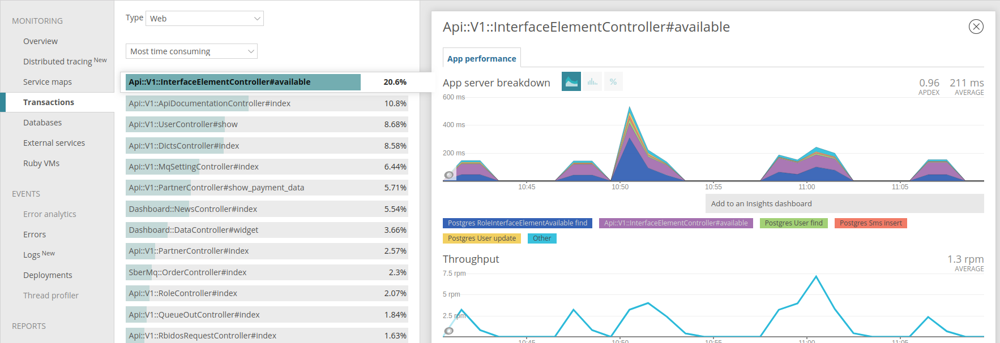
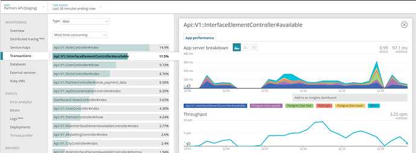
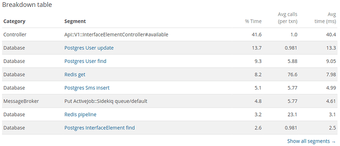
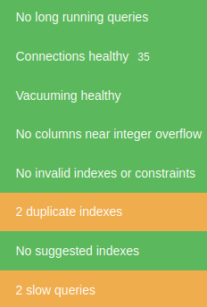
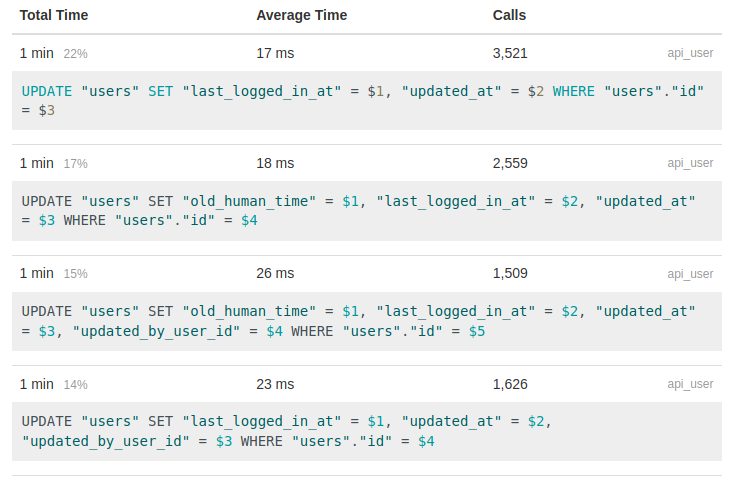
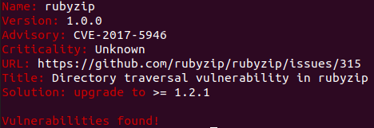
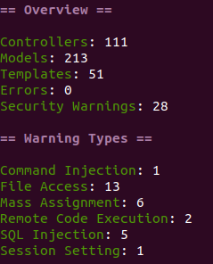

# Домашнее задание №8

## О проекте

- [x] Онлайн регистрация бизнеса, ВебОкно (это видимая часть, помимо других скрытых сервисов)
- [x] Разрабатывается 8 лет (ВебОкно)
- [x] Про перформансан забавный вопрос конкретно в данном продукте: если апи отвечает более 2 сек тогда идет запрос от бизнеса и проблема решается. Менее не считается проблемой
- [x] Мониторинг есть для тестового окружения и очень ограниченно
- [x] Навскидку сложно, т.к. проект полностью устраивает бизнес в плане производительности.
- [x] Проект условно можно поделить на 3 не пересекающиеся части: бек, фронт, тестирование. На бек стороне все 7 человек равнозначны в плане задач: из любой части бек проекта тебе приходит задание, решаешь, коммитишь

## Что сделано на рабочем проекте

### case 1

* rpm.newrelic.com используется в нашем проекте для тестового контура. Перенести для продакшена разрешение получить не удалось. Для теста:



Нашел точку росту. Это метод при сериализации выполнял N+1 запрос, т.к. сериализация выполняется для каждой роли:

```ruby
  def active
    active_role = current_user.roles.find do |role|
      riea = ::RoleInterfaceElementAvailable.find_by(role: role, interface_element: object)
      riea&.active_for_user(user: current_user)
    end
    active_role.present?
  end
```

добавил кеш
```ruby
  def active
    interface_element_available_by_current_user
  end

  private

  def interface_element_available_by_current_user
    Rails.cache.fetch(cache_name) do
      active_role = find_active_role_current_user
      active_role.present?
    end
  end

  def find_active_role_current_user
    current_user.roles.find do |role|
      riea = ::RoleInterfaceElementAvailable.find_by(role: role, interface_element: object)
      riea&.active_for_user(user: current_user)
    end
  end

  def cache_name
    "interface_element_available/#{current_user.role_slugs.join('_')}_#{object.id}"
  end
```

т.к. теперь нужно очищать те ключи которые меняются админом, добавил в модель RoleInterfaceElementAvailable

```ruby
  after_save :expire_cache_by_role_and_interface_element

  def expire_cache_by_role_and_interface_element
    Rails.cache.delete_matched('interface_element_available/')
  end
```
проблема перестала быть основной агонией



время ответа уменьшено чуть более чем в 2 раза.




### case 2

На тестовый контур по админы установили PgHero. Получил данные




вроде все отлично 2 индекса и 2 медленных запроса это не проблема для базы, но начал разбираться и оказалось что 4 скрипта 




из топа которые выполняются 68% времени генерируются 3 строками кода

```ruby
  self.last_logged_in_at = Time.current
  self.old_human_time = opteions[:human_time]
  save(validate: false)
```

самое страшное, что любой запрос к продукту ***спотыкается*** на 17-26мсек в этом месте. 
Данные “логи” были введены около 2 лет назад, при разработке 2 версии продукта, сейчас версия приближается к 7 и никто не помнит зачем такое частое логирование, но данный факт (логирование) активно используется по коду. 
Как решение обернуть запись логов в Job (быстрый фикс проблемы) исключаем остановки, а далее нужно уже очень хорошо думать возможно основательно менять. 

PgHero безопасность не пропустила к использованию на проде.

### case 3

описал в 7 задании, Коротко это проделана работа по ускорению тестов. 

### case 4

проверил гемы

* `bundler-leak check` : `No leaks found`
* `bundler-audit check`



* `brakeman` эпик фейл!


