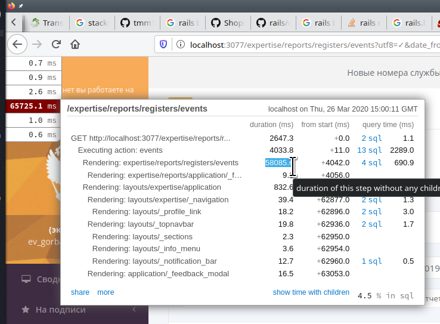
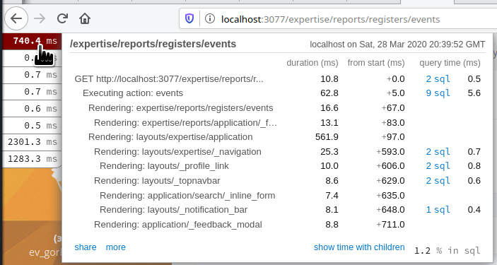
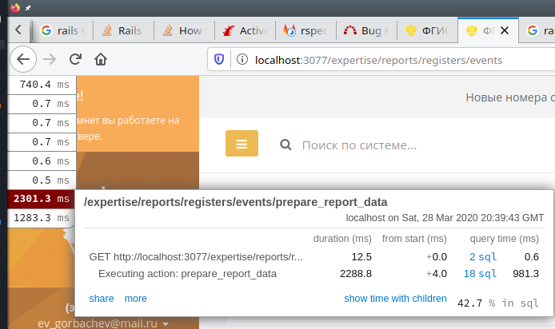
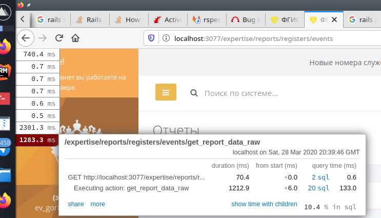

Для 8-го задания переговорив с руководителем получил задачу оптимизировать страницу с отчетами, рендерниг которой при генерации отчетат в таблице занимает непримелимое количество времени.
1. Первое с чего начал это подобрал оптимальный период, при которм был явный рост времени работы, но не достаточно большой, что бы был быстрый feedback.

2. Дальше решил посмотреть отчет rakemini-profiler-а. Сразу же была найдена главная точка роста - 90% времени уходило на рендеринг старницы. Анализ кода показал, что для отрисовки таблицы используется js plugin `DataTable` и на фронт приходит полностью вся выборка. Не был реализован server-side механизм работы. На этом решил остановиться с профилированием, т.к. была найдена проблема и перешел к реализиции server-side механизма работы для отображения резултатов в `DataTable`
3. После первой итерации, переделав на server-side работу, без каких-либо изменений в логике сбора данных уадлось ускорить отображение в 6 раз. Так же в процессе переработки было найдено, что при первоначальной загрузке всегда происходил предварительный сбор данных, тогда как эти данные требовались только при скачивание результатов.

    ````ruby
        collection = set_interval(events_resources)
        collection = status_filter(collection)
    
        if params[:task] == "download"
          files = []
          collection.each do |survey|
            document_for_dowload = Document.find_by(id: @conclusions.to_h[survey.id])
            next unless document_for_dowload
            files << [File.open(document_for_dowload.upload.path), document_for_dowload.upload_file_name]
          end
          zipline(files, "мпи_экспертные_заключения_#{@date_from}_#{@date_to}.zip")
        else
          render locals: { surveys: collection }
        end
    ````
    превратилось в 
    ````ruby
      def events
        if params[:task] == "download"
          collection = set_interval(events_resources)
          collection = status_filter(collection)
          files = []
          collection.each do |survey|
            document_for_dowload = Document.find_by(id: @conclusions.to_h[survey.id])
            next unless document_for_dowload
            files << [File.open(document_for_dowload.upload.path), document_for_dowload.upload_file_name]
          end
          zipline(files, "мпи_экспертные_заключения_#{@date_from}_#{@date_to}.zip")
        end
      end
    ````
4. Повесил на ajax success callback отрисвку таблицы, вместо submit-а, что бы не перерендеривать всю страницу заново.
5. Затем, что бы данные не собирались при кажом ajax запросе, при запросе новй страницы таблицы, поместил собранные данные в кеш. Это позволило уменьшить время отображения отпагинированных страниц с 11 секунд до 2.5.
6. Проанализировав сбор данных для отчета, нашел, что происходит запрос на выбор большого количества из самой большой таблицы в нашей бд. Первоначальная выборбку можно было доплнительно ограничит по дате, что и было сделано. В результате получилось уменшить время на тестовом интервале еще с 11 до 1 секунды.
7. На этом для задания решил закончить, но дальше уже буду профилировать непосредственно сам алгоритм сбора данных для табицы. Т.к задача срочная приходиться балансировать между эффективностью работы и скоростью вненсения изменений.
8. Так же надо допишу тест на защиту от регресси, уже добавил bootsnap  в development. 



Результат: полное время затраченное на получения отчета сократилось с 60 секунд до 3(0.7 рендеринг первоначальной страницы, 2.3 на подготовку данных. 1.3 на ajax запрос данных и их отображение). 