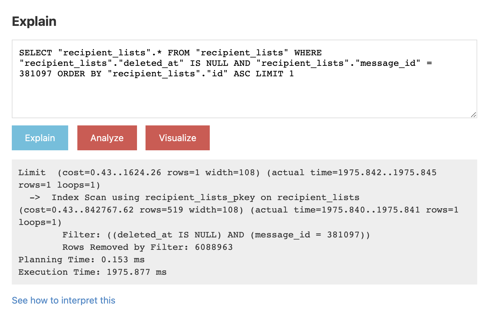
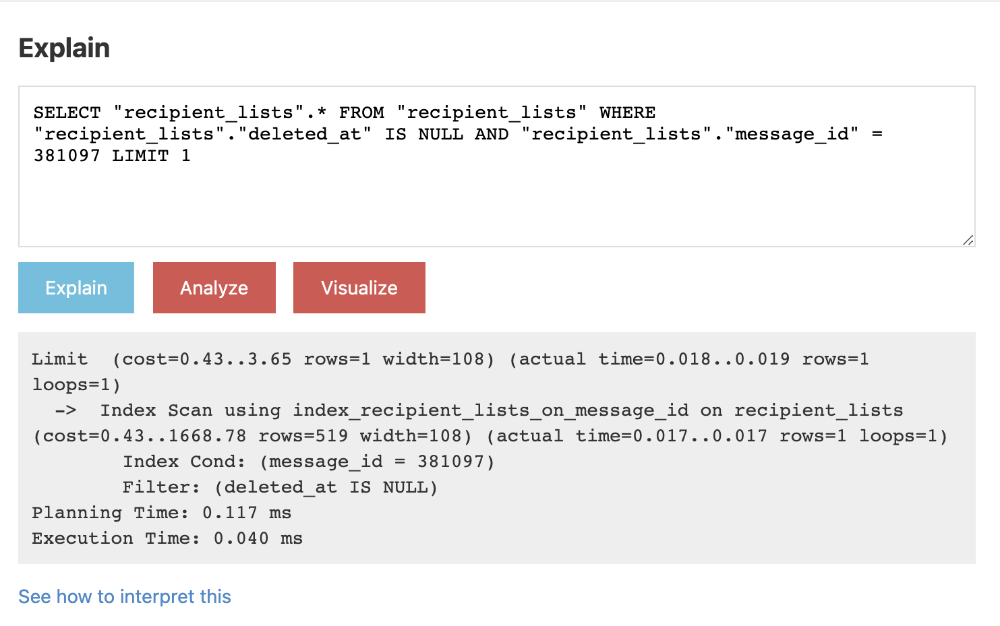
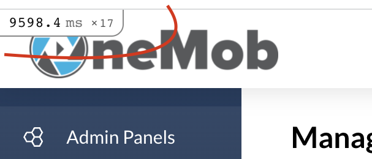
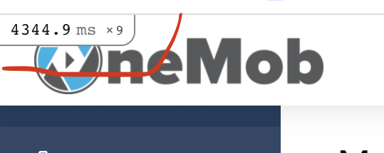

## О проекте

OneMob - маркетинговый инструмент, позволяющий эффективно делиться информацией. Это если в двух словах.

### Основной функционал
- Приложение позволяет пользователю создать свою библиотеку контента (видео, документы, ссылки, изображения).
- Приложение предоставляет инструменты для загрузки контента, а также полноценный браузерный видео-рекордер
  и инструменты редактирования видео.
- На основе контента пользователь довольно легко может создавать простые лэндинг пэйджы.
- Далее на основе лендинг пейджа создается Campaign - кампания.
- Пользователь может делиться кампанией путем отправки имэйла с линком или через любые источники
  (соц. сети, вебсайты, мессенджеры) просто используя линк на кампанию.
- Все просмотры и активности на странице кампании отслеживаются, составляется детальная статистика статистика.

Проекту порядка 7 или 8 лет, много легаси, 4 версии api, 2 мобильных приложения.
В Web версии использован подход SPA.
В данный момент мы в процессе глобального обновления: переезжаем со старого angular на react,
полностью обновляем интерфейс, пересматриваем весь функционал. Это в свою очередь требует новой версии бэкэнда
(api, сериалайзеры, операции итп). Миграция завершена примерно на 80% - 90%.
Ввиду этого, полномасштабной оптимизацией в данный момент заниматься нет смысла, т.к в теории большая часть
старого кода будет удалена, запросы переделаны, вероятно возникнут абсолютно другие точки роста.

Кейсы оптимизации в основном связаны с самыми проблемными местами старого приложения, которые не терпят ожидания,
оптимизацией энвайромента.
Также часть нового кода была пересмотрена с учетом оптимальности подхода.

Над проектом я работаю порядка 5 лет, в основном как full-stack разработчик, последние полгода - как tech lead.

### Основными техническими проблемами приложения в данный момент я вижу:
- Большой объем легаси кода, который практически закрыт для принципиальных изменений, который довольно сложно поддерживать.
- Из за переезда и одновременного существования 2 приложений (angular и react) assets_pack просто огромный.
  После завершения миграции нас ждет глобальная чистка.
- Множество сложных и неоптимальных запросов. Ввиду разросшейся базы с некоторыми из них все чаще начинают возникать проблемы.
- Недостаточный объем собираемых метрик

## Проделанная оптимизация

Для начала было установлено несколько инструментов для сбора метрик: `PGHERO`,
`rack_mini_profiler` (подключен в т.ч в production), `memory_profiler`.
Установка `NewRelic` была отложена до релиза новой версии, т.к в данный момент это требует ресурсов (в т.ч времени),
к тому же нет смысла собирать данные со старого приложения.

### Case 1.

Проблема: landing_page приложения загружается довольно долго, пользователи вряд ли будут счастливы ждать.

Решение:
- Проверил страницу с помощью WebPageTest, по результатам проверки выяснилось, что 82% загружаемого контента - изображения.
- С помощью встроенных инструментов WebPageTest оптимизировал большинство тяжеловесных изображений
- Объем изображений значительно сократился, страница стала грузиться ощутимо быстрее. К сожалению конкретных метрик не сохранилось.
- Т.к landing_page построен на react с клиентским рендерингом - не нашел пути использовать http/2 server-push для данного случая

### Case 2.

Проблема: QA и служба поддержки сообщили о проблеме - некоторые конкретные части приложения начали сильно тормозить.

Решение:
- Соответствующие страницы и функционал были проверены с помощью `rack-mini-profiler`
- Профайлер показал, что один из запросов, на первый взгляд довольно легкий, выполняется экстремально долго (порядка 3 сек).
  

- Для начала я решил проверить для чего он вообще нужен и исследовал код. Оказалось что запрос вызывается из сериалайзера,
  сериалайзер при этом использован в нескольких местах и в зависимости от ситуации некоторые данные из него вообще не нужны.
  Убрал этот запрос из случаев в которых он не нужен - время в этих случаях сократилось до нуля.
- Тем не менее запрос все еще выполнялся в других местах с тем же болезненным эффектом. Было принято решение проанализировать его.
- pg analyze показал что все необходимые индексы присутствуют и используются, на первый взгляд оптимизировать оказалось нечего.
  

- Поэкспериментировав с запросом обнаружилось, что дело в сортировке. Убрал сортировку и время на запрос сократилось с 2-3сек до 0.04мс.
- Изучение кода создающего запрос показало, что сортировка там не имеет никакой необходимости:
  нужно получить связанную через has_many запись, но в случаях когда это требуется запись всегда одна, соответственно нечего и сортировать.
- Запрос осуществлялся таким образом: `object.recipient_lists.first`. Оказалось что `.first` добавляет к запросу сортировку.
  Заменил `.first` на `.take` - проблема решена, запрос исчез из топа pghero.
  

### Case 3.

Проблема: как я говорил ранее, одной из главных проблем приложения являются медленные запросы в базу.
При одном и том же наполнении базы некоторые запросы пролетают мигом локально, но висят в продакшне.

Решение:
  - Последовав одной из рекомендаций курса мы решили обновить версию postgres, c 12 на 14.
  - Обновление не удалось с первого раза. Проводили мы его с помощью встроенного скрипта aws.
    Некоторые запросы которые работали быстро на старой версии стали отваливаться по таймауту после обновления. Откатились.
  - Второй раз обновились вручную, пошагово. После обновления проследовали инструкциям оптимизации базы под новую версию.
  - В результате время всех запросов на сервере сократилось примерно вдвое. Графика метрики у нас пока нет, но проверка через
    rack-mini-profiler для аналогичных страниц показала примерно такие результаты:

До:

После:

