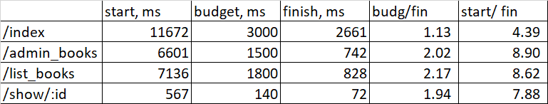
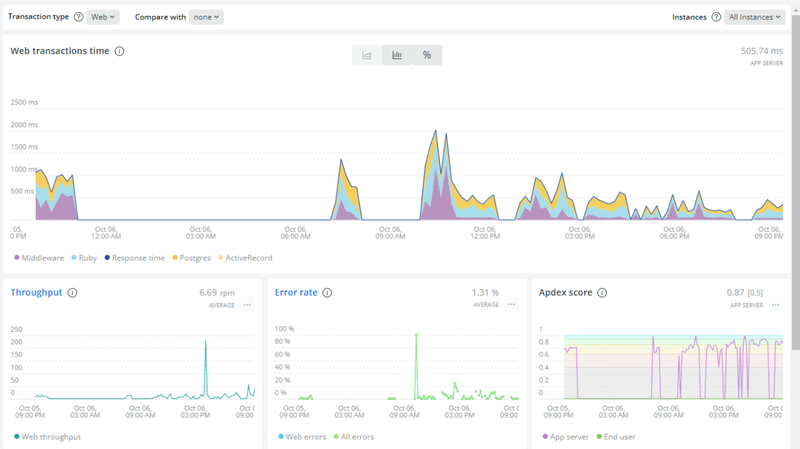

# Case-study

## About project
Для оптимизации выбрал простой проект, который разрабатывался около 2-3 лет назад. 
Его цель - упорядочить работу с книгами в корпоративной библиотеке одной из компаний г.Минска.
Проект небольшой, но для выполнения заданй думаю подойдет вполне + он снова актуален, т.к. несколько месяцев назад, когда перезагружали работу с библиотекой в компании, вспомнили об этой идеи и к проекту вернулись.
По поводу перфоманса, лог ужасает, предполагаю огромное количество проблем `n+1`, но это еще раз подтверждает, что и для выполения задания подойдет и для дела будет отлично.
Да и по восприятию основные страницы работают медленно.

## Бюджет и метрика
Как метрика - время загрузки страниц, для замеров выбрал 4 основные точки - следующие страницы и бюджет по ним (*не знал какой бюджет выбрать, поэтому просто решил для себя "в 4 раза быстрее")
* Главная страница `/index` - 3000ms
* Админка книг_таблица `/admin_books` - 1500ms
* Таблица книг для юзеров `/list_books` - 1800ms
* Страница одной книги `/show/:id` - 140ms

## Исходные значения
* `/index`
11672ms (Views: 4354.7ms | ActiveRecord: 5464.3ms)
* `/admin_books`
6601ms (Views: 5239.0ms | ActiveRecord: 1156.0ms)
* `/list_books`
7136ms (Views: 5670.9ms | ActiveRecord: 1448.1ms)
* `/show/:id`
567ms (Views: 352.6ms | ActiveRecord: 214.4ms)

## Feedback-Loop
Для того, чтобы иметь возможность быстро проверять гипотезы я выстроил `feedback-loop`, который позволил мне получать обратную связь по эффективности сделанных изменений
* замер
* изменения
* замер
* прогон тестов
* коммит или откат

## Используемые инструменты
* rails logs
* pghero
* rack-mini-profiler
* newrelic
* bullet

## Общее виденье (предварительно)
Само приложение маленькое и "бутылочное горлышко" очевидно - это передача данных в бэка на фронт (само приложние Rails + Vue). Так что основное внимание на подготовку и отправку данных на фронт.

## 1 Итерация
Первое, что начал анализировать логи. Невероятное количество запросов по данным, которые вообще не рендерятся. Подчистил сериалайзеры, Пока разделил сериалазинг коллекции и инстанса на два сериалайз класса.
В итоге:
* `/index` - 2814ms (Views: 1460.5ms | ActiveRecord: 1347.8ms)
* `/admin_books` - 3770ms (Views: 2243.7ms | ActiveRecord: 1501.9ms)
* `/list_books` - 3030ms (Views: 1905.4ms | ActiveRecord: 1115.1ms)
* `/show/:id` - 210ms (Views: 113.1ms | ActiveRecord: 77.4ms)

## 2 Итерация
Поработал с рекомендациями гема `bullet`, т.к. логи еще не радуют, ббольшое количество в том числе `n+1`. Добавил несколько `preload` и `counter_cache`. Дополнительно пересмотрел методы в моделях, сократил количество обращений к БД.
В моделях также заменил `.any?` на `.exists?`.
* `/index` - 2523ms (Views: 1723.3ms | ActiveRecord: 794.0ms) - **В БЮДЖЕТЕ**
* `/admin_books` - 2302ms (Views: 1664.6ms | ActiveRecord: 633.4ms)
* `/list_books` - 1475ms (Views: 1003.6ms | ActiveRecord: 454.2ms) - **В БЮДЖЕТЕ**
* `/show/:id` - 137ms (Views: 41.3ms | ActiveRecord: 62.2ms) - **В БЮДЖЕТЕ**

Метрика по загрузке `/index` немного ухудшилась от пред. замера, т.к. добавил немного логики в приложение. Сам бюджет не трогал.
Рекомендаций от `bullet` больше нет.

## 3 Итерация
Решил посмотреть в сторону методов и логики. Профилировщики показывают точку роста в сервисе по фильтрации и сортировке книг. Немного изменил логику и подходы.
Плюс, когда разбирал приложение нашел еще один косяк в серилайзинге, я при вызове категорий по книгам постоянно грузил все книги по всем категориям. Итоги после изменений 3 итерации:
* `/index` - 2889ms (Views: 0.6ms | ActiveRecord: 1069.5ms) - **В БЮДЖЕТЕ**
* `/admin_books` - 838ms (Views: 515.0ms | ActiveRecord: 305.1ms) - **В БЮДЖЕТЕ**
* `/list_books` - 1198ms (Views: 835.1ms | ActiveRecord: 360.4ms) - **В БЮДЖЕТЕ**
* `/show/:id` - 108ms (Views: 39.8ms | ActiveRecord: 42.6ms) - **В БЮДЖЕТЕ**

## 4 Итерация
Несмотря на то, что бюджет выполнен уже в прошлой итерации, думаю, что с таким количетсво проблем в подготовке данных просто необходимо изменить сам инструмент сериалайзинга.
Установил `fast json api` и переписал основнйо сериалайзер на него.
Итоги:
* `/index` - 2661ms  - **В БЮДЖЕТЕ**
* `/admin_books` - 742ms - **В БЮДЖЕТЕ**
* `/list_books` - 828ms  - **В БЮДЖЕТЕ**
* `/show/:id` - 72ms  - **В БЮДЖЕТЕ**

## Итого
* удалось проанализировать приложение, определить точки роста и основные подходы в последующей разработке. которые позволят поддерживать хорошую произовдительность
* установлены и настроены инструменты монитооринга и профайлинга, что позволит обеспечить непрерывный процесс работы с провизвдительностью
* реализованы 4 итерации, которые позволили выполнить (и перевыполнить) бюджет
* ГЛАВНОЕ и ИТОГО - заложен базис для будущих побед! :) работа будет продолжена

## PS
[Код_изменения](https://github.com/iL53n/ekt_library/pull/48)
### DX_Tests
Тесты были оптмизированы в рамках выполенния задания 7 курса.
### Newrelic

