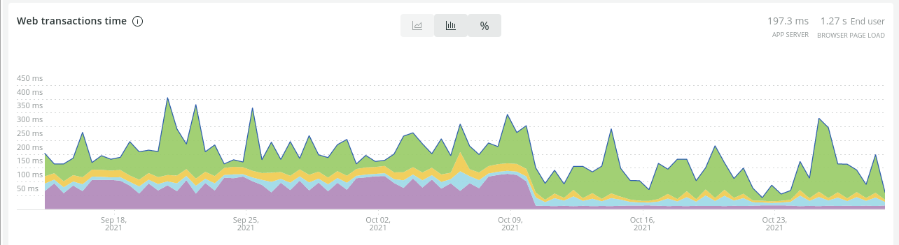

# О проекте

Проект -- админка + личный кабинет клиента.
В личном кабинете клиент может покупать лицензии на основной продукт, смотреть свои счета и платежи, заводить тикеты.
В админке построено управление клиентами, лицензиями, платежными системами и продажами. Традиционно в комплекте гора отчётиков.

Проект разрабатывается с 2013 года и 3-их рельс, на момент моего прихода были 4 рельсы и руби 2.3, сейчас 6.1 и 2.7 соответственно.

На данный момент у пользователей нет конкретных жалоб на перфоманс, отчет NewRelic для конечного юзера показывает Apdex 0.99 и среднее время полной загрузки 1.14с, среднее время ответа апп сервера 167мс.
В том же нью релике нет явно страдающих страниц, разве что несколько отчетов которые открываются раз в месяц. Ради интереса можно попробовать их попрофилировать, но пока на это времени выделить не получилось ибо конечного профита почти нет.

Нагрузка на проект не очень большая, у нас примерно 50 человек активных пользователей админки и примерно 2000 живых клиентов.

Для мониторинга у нас используются NewRelic а также Prometheus + Grafana, раньше еще была сборка перфоманса в Aitbrake но она явно проигрывает нью релику, да и от основной функциональности Эирбрейка отказались в пользу Sentry.

На проекте два года, на момент прихода был единственным разработчиком, сейчас тимлид небольшой команды и 3 человек.

# Оптимизации

## Оптимизация DX

### Оптимизация тестов
В рамках 7 дз оптимизировали тесты ускорив их в 3.5 раза, теперь гораздо удобнее прогонять их локально и быстрее проходит CI.

### Оптимизация сборки ассетов

Решил посмотреть что там с ассетами, обнаружил что у нас так и живет в скопившемся легаси фронта целых три Jquery -- один через гем, один через вебпак и один в папочке vendor.
Оставили только тот что через вебпак, ассеты собираются быстрее и в лк клиента объем подключаемого жс упал в два раза -- с 3 до 1.5 мб, так что тут оптимизация не только DX но и браузерная.

Ещё одна "оптимизация" -- в проекте была небольшая часть на реакте, выкинули реакт целиком, испытали много радости. Ну и соответственно асеты собираются теперь быстрее.

### Оптимизации Gitlab CI

Немного оптимизировал CI удалив явно лишнее и добавив кеширование прекомпилированных ассетов, в слуае если фронт не менялся теперь экономим несколько минут.
Еще одна небольшая оптимизация -- удалял прогон последний стадии (деплой) для всех веток кроме мастера и стейджинга, там все равно ансибл ничего не делал потому что нет хостов а время на инициализацию таски тратилось.

## Оптимизация приложения

### Обновление руби/рельсов

Мы регулярно обновляем руби/рельсы в своих проектах, если в начале это было настоящьей болью -- куча легаси-кода, тонны деприкейшенов, околонулевое покрытие тестами, то сейчас все обновления проходят достаточно гладко, как по мне это показатель качества кода и уровня техдолга в проекте.
К сожалению, конкретных замеров влияния на производительность между обновлениями не проводили.

### Оптимизация бд

Подключили pgadmin, коллега добавил индексов, ушло несколько медленных запросов

### Снижение лишней нагрузки с помощью нью релика

Нью релик показал что огномное количество нагрузки генирируется миддлваре которая собирает некоторые не особо нужные кастомные метрики в прометеус.
Выкинули их, график говорит сам за себя

### Оптимизации внешних сервисов

С помощью того же нью релика заметил что много времени уходит на внешние запросы, там где это возможно -- оптимизировали их с помощью асинхронных запросов и кеширование, для некоторых сервисов завел тикеты на ответственных за сервис с простбой ускорить его работу.

# Запланированные оптимизации

## Обновление линукса и пакетов
На проде 18 убунта с отключенными автообновлениями, запланировали поставить свежую

## Обновление постгреса
У нас стоит очень старая версия (10), запланировали переезд на новую

## Оптимзация фронтенда
Заметил в coverage что подключается очень жирная либа которая на первый взгляд нигде не нужна, поизучаем этот вопрос

## Применение бест-практис
В курсе узнал немало нового (к слову, Алексей, большой Вам спасибо!), хочется чтобы в голове отложилось как можно больше, в частности всякие мелочи типо применения `.take` вместо `.first` и тд.
В целом один из главных результатов курса лично для меня -- я стал больше задумываться над кодом который пишу с точки зрения производительности, и теперь обладаю пониманием какие инструменты можно использовать для профилирования
