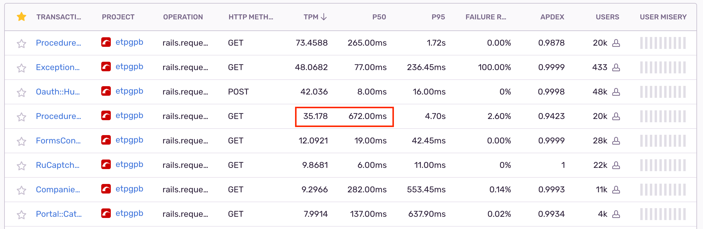
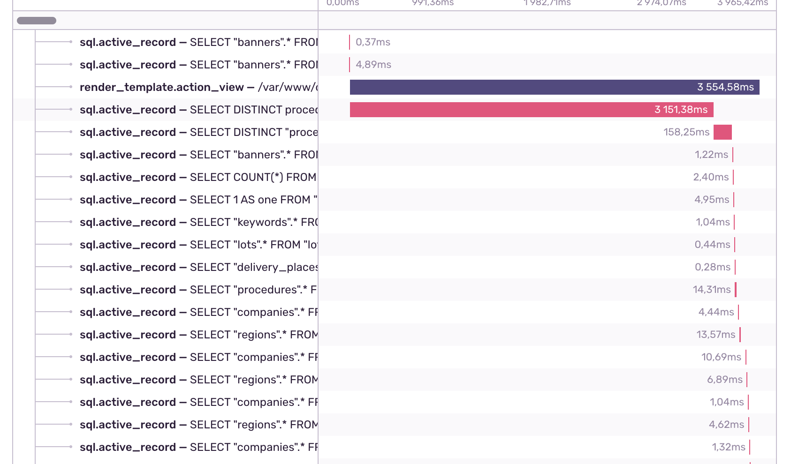

# HW8

## О проекте

Мой основной проект - Электронная торговая площадка Газпромбанка [https://etpgpb.ru/](https://etpgpb.ru/), разрабатывается уже ~10 лет.

По перформансу на проде особых проблем не возникает, задач на оптимизацию самого сайта почти не поступает, но я думаю можно найти проблемные места и ускорить основные страницы, выиграть по скорости у основных конкурентов, улучшить впечатление клиентов и возможно выиграть какие-то деньги для компании за счет оптимизаций. Но самой актуальной и важной проблемой сейчас являются тесты.

Есть мониторинг `Sentry`, в котором мне предстоит получше разобраться и многое переосмыслить после прохождения курса, так как раньше я там только мониторил ошибки, и есть `pghero`, в который я до этого ни разу не заходил :)

Я являюсь backend-разработчиком, занимаюсь большей частью всех доработок по проекту.

Самая актуальная проблема на текущий момент - это долгие тесты. Много тестов в целом, много тестов на эластик, на мой взгляд именно они занимают больше времени + эластик создаёт плавающие баги в тестах. Таким образом, у нас очень замедляется CI, иногда падают тесты на ровном месте, тестировщикам приходится долго ждать деплой на стейдж, и в целом весь цикл от реализации задачи до деплоя в прод сильно затормаживается.

## Кейс №1

Решил оптимизировать важный сейчас API-метод, так как в ближайшее время один из основных ресурсов приложения перейдёт на Vue и Rails API, ранее было всё на рельсах. Экшн - `ProceduresController#index`.

Кейс не особо интересный, но так как вписывается в рамки курса, то решил о нём тоже написать. Здесь я уже вижу несколько N+1 и предупреждения буллета. RMP показал, что на странице из 30 процедур выполняется `129 sql` за `339.0ms`.

После небольших усилий для того, чтобы разобраться как правильно заинклудить многоуровневые связи через `through` (оказалось всё даже проще, чем я пытался сделать, благодаря рельсам и связям активрекорд :)), получилось уменьшить количество запросов до `93 sql` и время до `79.0ms`.

Но дальше я понял, что осталось еще очень много запросов и я подумал, что возможно грузится много лишнего, вообще ненужного для этого апи метода. Увидел, что есть запросы из application_controller, которые не нужны, я вынес `format json` в отдельный контроллер и унаследовал от `ActionController::API`, таким образом уменьшил общее количество `SQL` запросов до `66 sql`, затраты по времени примерно такие же.

|        | SQL | ms  |
|--------|-----|-----|
| before | 129 | 339 |
| after `includes`  | 93  | 79 |
| after moving to api controller | 66 | 77 |

### Итог

Сильно облегчил работу БД, и ускорил загрузку API-метода. Раньше смотрел rmp, алерты bullet'а, но почти не заглядывал внутрь отчёта. Теперь, благодаря курсу, я стал лучше ориентироваться в rmp, заглянул в запросы и понял, что часть запросов вообще не нужны. Также стал лучше понимать как работают `includes` и подобные методы. Следующая идея по оптимизации - вынести все данные в индекс эластика и сериализовывать их напрямую оттуда, перестать обращаться к БД.

## Кейс №2

*Следующим кейсом должны были быть тесты, но оказалось, что ими я уже занимался в ДЗ №7, поэтому нахожу следующую страницу для оптимизации по `Sentry`.*

Я зашел на вкладку Performance, попытался найти что-то по типу параметра agony, но, к сожалению, ничего подобного не нашел. Тогда я отсортировал экшны по количеству запросов в минуту и путем нехитрых подсчетов нашел следующего кандидата на оптимизацию.



Посмотрел подробнее один из ивентов, там увидел, что очень большую часть времени занимает один запрос.



RMP показал, что страница грузится за 16 секунд и есть 2 долгих запроса. Будем оптимизировать их по очереди.

### Запрос №1

Первый из них локально идёт 11 сек. Я зашел в `psql` и сделал `EXPLAIN`.

Увидел:

```
->  Parallel Seq Scan on nomenclatures  (cost=0.00..13793.61 rows=38 width=4)
      Filter: ((code)::text = '24.20.21.000'::text)
```

Нужно попробовать добавить простой индекс на поле `code`, чтобы оптимизатору не пришлось идти по всем записям.

**После добавления индекса этот запрос стал проходить за `15 мс`!**

### Запрос №2

Второй запрос выполняется 5 секунд.

`EXPLAIN` 2-ого запроса показал еще один `Seq Scan` внутри `Nested Loop`:

```
->  Parallel Seq Scan on lots  (cost=0.00..27458.24 rows=1658 width=4)
      Filter: ((status <> 12) AND (date_end_second_parts_review > '2022-08-25 13:13:58.306437'::timestamp without time zone))
```

Пробуем опять добавить индекс, теперь уже на 2 поля. Результат стал лучше, но все равно достаточно долго, попробую сделать более конкретный функциональный индекс с `::timestamp without time zone` и `where status <> 12`. **Запрос выполняется теперь за `1,3 сек`.**

Но результат всё ещё плохой, поэтому продолжаю оптимизацию, следующая точка роста в этом же запросе - это `Parallel Index Scan using index_procedures_on_updated_at on procedures`, который скорее всего использует не совсем оптимальный для него индекс. Фильтр: `((deleted_at IS NULL) AND (NOT archive) AND (id <> 155031) AND ((platform_name)::text = 'etp'::text))`, индекс пробую вот такой `add_index :procedures, %i[updated_at id platform_name], where: '(deleted_at IS NULL) AND (NOT archive)'`. 

После добавления индекса, в фильтре осталось только `Filter: (id <> 155031)`, а **запрос стал выполняться за `127 мс`**.

### Итог

Загрузка страницы на локальном сервере изменилась **`с 16 сек до 800 мс`**, ускорилась более чем в 16 раз, а sql запросы, которые выполнялись **`15-16 сек`**, стали выполняться за `200 мс`. Также удалил 9 лишних индексов по мнению `pghero`)