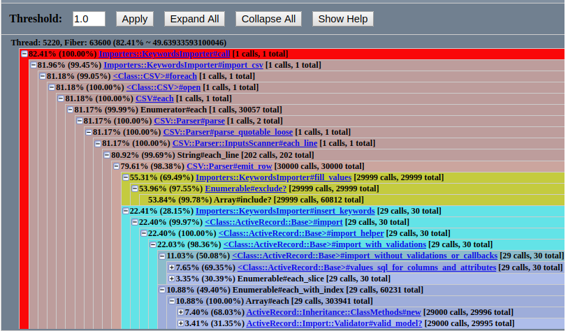
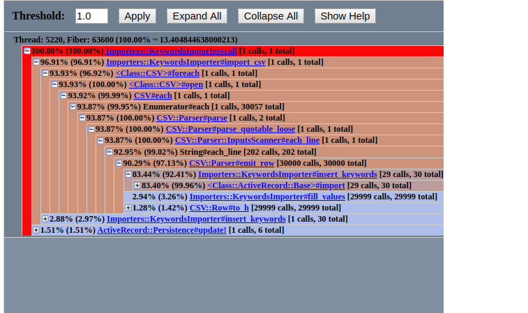

## To start

Для начала напишите немного о своём проекте.

- Инструменты для SEO-специалистов
- Проекту 4 года, в этом прошлом году делалась замена фронта + рефакторинг
- Есть проблемы со скоростью формирования некоторых отчетов
- Мониторинга нет, основными метриками считаются скорость формирования отчета 
- Формирование отчетов можно ускорить(есть неоптимальный код + неоптимальный sql)
- Делал рефакторинг проекта, переделал фронт(убрал ангуляр), переписывал тесты(+ дописывал), рефакторил код, оптимизировал узкие места 

### О чём интересно рассказать

- На большой объеме данных стал медленно формироваться отчет(на маленьком объеме проблем не было)
- Метрика: скорость формирования отчета(определенный набор данных до 10 минут)
- `ruby-prof`  

Изначально был такой код:
```
module Importers
  class KeywordsImporter
    BATCH_SIZE = 10_000

    attr_reader :keywords_import_file, :project

    def initialize(keywords_import_file)
      @keywords_import_file = keywords_import_file
      @project = keywords_import_file.project
      @keywords = []
      @uniq_values = []
    end

    def call
      raise Errors::SegmentationStartError if project.tasks.working.any?

      task.subscribe(Listeners::ProjectProgressListener.new(project))
      task.subscribe(Listeners::GlobalProcessesListener.new)
      task.run!(progress: 0, message: 'Keywords import started')
      import_csv
      task.update!(progress: 90, message: 'Updating counters')
      project.reset_counters
      task.success!(progress: 100, message: 'Success')

    rescue Errors::SegmentationStartError
      task.fail!(progress: 100, message: 'Project segmentation already started')
    rescue StandardError => e
      task.fail!(progress: 100, message: e.message)
      Rollbar.error(e)
    end

    private

    def import_csv
      task.update!(progress: 65, message: 'Importing keywords')
      CSV.foreach(import_file_path, headers: true, encoding: 'ISO-8859-1') do |row|
        fill_values(import_columns.transform_values { |v| row[v] }.merge(original_data: row.to_h))
        next if @keywords.length < BATCH_SIZE

        insert_keywords
      end
      insert_keywords
    end

    def fill_values(parsed_keyword)
      keyword_name = parsed_keyword['name'].try(:strip)
      return if keyword_name.blank?

      original_data = parsed_keyword[:original_data].presence || {}
      if @uniq_values.exclude?(keyword_name)
        @keywords << {
          project_id: project.id,
          name: keyword_name,
          url: parsed_keyword['url'],
          rank: parsed_keyword['rank'],
          monthly_searches: parsed_keyword['monthly_searches'].presence || 'NULL',
          original_data: original_data
        }
        @uniq_values << keyword_name
      end
    end
```

- Тестовый набор 30_000 записей
- Время выполнения: 31.44 сек.

Профилируем и видим, что главная точка роста это `exclude?`: 



Меняем структуру данных тип хранилища уникальный значений(`@uniq_values`) с Array на Set
```diff
    def initialize(keywords_import_file)
      @keywords_import_file = keywords_import_file
      @project = keywords_import_file.project
      @keywords = []
-     @uniq_values = []
+     @uniq_values = Set.new
    end
    
    def fill_values(parsed_keyword)
      keyword_name = parsed_keyword['name'].try(:strip)
      return if keyword_name.blank?

      original_data = parsed_keyword[:original_data].presence || {}
      if @uniq_values.exclude?(keyword_name)
        @keywords << {
          project_id: project.id,
          name: keyword_name,
          url: parsed_keyword['url'],
          rank: parsed_keyword['rank'],
          monthly_searches: parsed_keyword['monthly_searches'].presence || 'NULL',
          original_data: original_data
        }
-        @uniq_values << keyword_name
+        @uniq_values.add(keyword_name)
      end
    end
```

- Время выполнения: 5.52 сек.

Профилируем и видим, что главная точка роста ушла



- Запускаем тесты - все ок
- Запускаем формирование отчета на основном наборе данных и оно прошло менее чем за минуту
  

